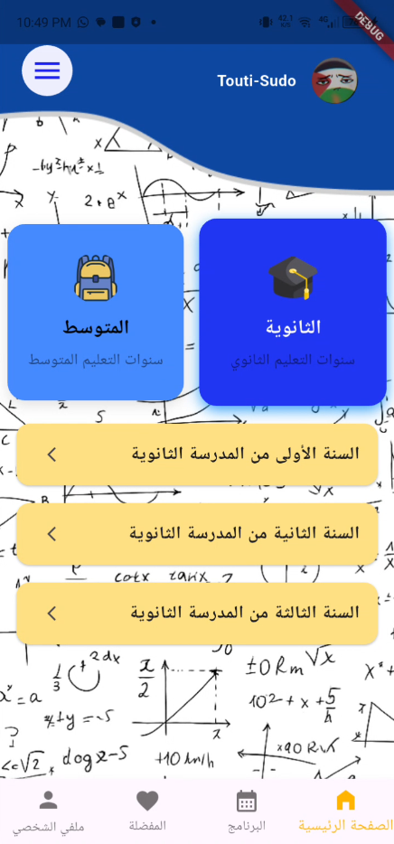
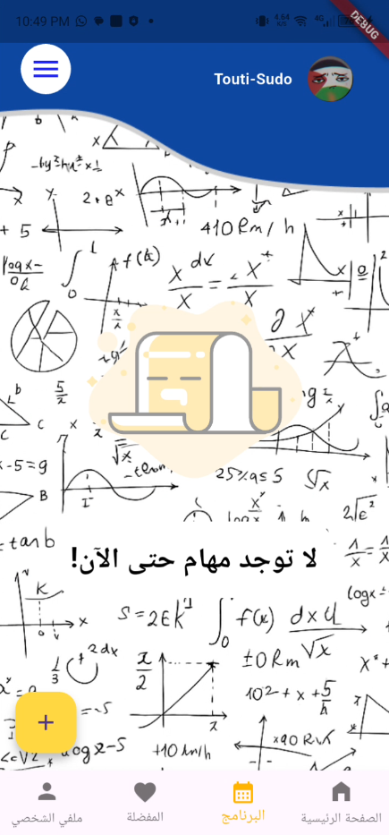
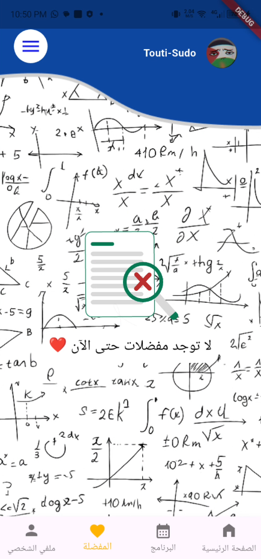
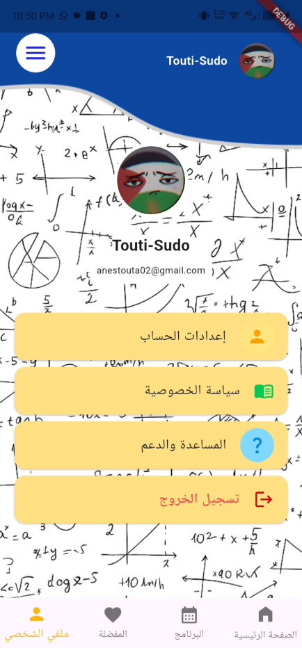

# **English Version**  : 
If you like this project, consider giving it a star! ⭐


# About the Project 


[](https://www.linkedin.com/in/kada-anes)
[](https://github.com/Touti-Sudo)


**MathDZ** is an open-source educational mobile application designed to help Algerian students learn mathematics in a simple, organized, and accessible way.
The app provides structured math lessons through YouTube video tutorials and PDF documents with exercises, grouped by class so that each class has its own videos and PDF files.


## 📥 Download 

Download the App here:

[](https://github.com/Touti-Sudo/MathDZ/releases/download/v1.0.0/app-release.apk)


---
# ✨ Features

- 📄 Math lessons and exercises in PDF format

- 🎥 YouTube video lessons integrated inside the app

- 🗂 Content organized by class/level

- ⭐ Favorite system for saving important remarks

- 🔄 Dynamic content loading from GitHub (JSON-based)

- 🎨 Clean, simple, and student-friendly UI

- 📱 Fully built with Flutter
---
# 🧱 Built With

* [Dart](https://dart.dev)
* [Flutter](https://flutter.dev/) 
* [Firebase](https://firebase.google.com)
* [Google Sign-In](https://developers.google.com/identity)
* [YouTube Player](https://pub.dev/packages/youtube_player_flutter)
* [HTTP](https://pub.dev/packages/http)
* [URL Launcher](https://pub.dev/packages/url_launcher)
* [Shared Preferences](https://pub.dev/packages/shared_preferences)
* [Provider](https://pub.dev/packages/provider)
* [Flutter Launcher Icons](https://pub.dev/packages/flutter_launcher_icons)
---
# 📸 Screenshots

<p>
    
    
    
    

</p>


# 🚀 Getting Started

### Prerequisites

* Flutter SDK (>= 3.0.0)
* Android/iOS setup

### Installation

1. Clone the repo:

```bash
git clone https://github.com/Touti-Sudo/MathDZ
cd MathDZ
```

2. Install dependencies:

```bash
flutter pub get
```


3. Run the app:

```bash
flutter run
```
---
# 📂 Project Structure
```
lib/
├── components/
│   │── dialog_box.dart
│   │── discord_tile.dart
│   │── my_button.dart
│   │── my_home_container.dart
│   │── my_login_container.dart
│   │── profile_boxes.dart
│   │── save_button.dart
│   │── todo_tile.dart
│   │── video_card.dart
├── data/
│   │── database.dart
├── pages/
│   │── auth_page.dart
│   │── class_details_page.dart
│   │── exams_page.dart
│   │── favorite_page.dart
│   │── help_and_support.dart
│   │── home_page_content.dart
│   │── home_page.dart
│   │── login_page.dart
│   │── on_boarding_page.dart
│   │── privacy_policy.dart
│   │── profile_page.dart
│   │── profile_settings.dart
│   │── program_page.dart
│   │── register_page.dart
├── services/
│   │── auth_service.dart
│   │── profile_avatare.dart
├── utils/
│   │── youtube_helper.dart
│── firebase_options.dart
└── main.dart
```
---
# 🤝 Contributing

Pull requests are welcome. For major changes, please open an issue first.

---
# 📄 License
This project is licensed under the GPL License. See the [LICENSE](LICENSE) file for details.

---

# 📬 Contact

* Developer: Anes
* Linkedin: Kada Anes
* GitHub: @Touti-Sudo
---
Special thanks to [@kaouther-rk](https://github.com/kaouther-rk)
for the amazing UI redesign (Figma).
---
# **النسخة العربية**
إذا أعجبك هذا المشروع، لا تنسَ منحه نجمة ⭐


# **النسخة العربية**

# حول المشروع

**MathDZ** هو تطبيق تعليمي مفتوح المصدر للهواتف الذكية، تم تصميمه لمساعدة التلاميذ الجزائريين على تعلم الرياضيات بطريقة بسيطة، منظمة، وسهلة الوصول.
يوفّر التطبيق دروس رياضيات مهيكلة عبر فيديوهات تعليمية على YouTube وملفات PDF تحتوي على تمارين، مصنّفة حسب المستوى الدراسي بحيث يكون لكل مستوى دروسه وملفاته الخاصة.

---

## 📥 التحميل

يمكنك تحميل التطبيق من هنا:

[](https://github.com/Touti-Sudo/MathDZ/releases/download/v1.0.0/app-release.apk)


---

# ✨ المميزات

* 📄 دروس وتمارين رياضيات بصيغة PDF
* 🎥 دمج دروس فيديو من YouTube داخل التطبيق
* 🗂 تنظيم المحتوى حسب المستوى/السنة الدراسية
* ⭐ نظام مفضل لحفظ الملاحظات المهمة
* 🔄 تحميل محتوى ديناميكي من GitHub (باستخدام JSON)
* 🎨 واجهة بسيطة، نظيفة، ومناسبة للتلاميذ
* 📱 مطوّر بالكامل باستخدام Flutter

---

# 🧱 التقنيات المستخدمة

* [Dart](https://dart.dev)
* [Flutter](https://flutter.dev/)
* [Firebase](https://firebase.google.com)
* [Google Sign-In](https://developers.google.com/identity)
* [YouTube Player](https://pub.dev/packages/youtube_player_flutter)
* [HTTP](https://pub.dev/packages/http)
* [URL Launcher](https://pub.dev/packages/url_launcher)
* [Shared Preferences](https://pub.dev/packages/shared_preferences)
* [Provider](https://pub.dev/packages/provider)
* [Flutter Launcher Icons](https://pub.dev/packages/flutter_launcher_icons)

---

# 📸 لقطات شاشة

<p>
    
    
    
    
</p>

---

# 🚀 البدء

### المتطلبات

* Flutter SDK (>= 3.0.0)
* إعداد Android

### التثبيت

1. استنساخ المستودع:

```bash
git clone https://github.com/Touti-Sudo/MathDZ
cd MathDZ
```

2. تثبيت الحزم:

```bash
flutter pub get
```

3. تشغيل التطبيق:

```bash
flutter run
```

---

# 📂 هيكلة المشروع

```

lib/
├── components/
│   │── dialog_box.dart
│   │── discord_tile.dart
│   │── my_button.dart
│   │── my_home_container.dart
│   │── my_login_container.dart
│   │── profile_boxes.dart
│   │── save_button.dart
│   │── todo_tile.dart
│   │── video_card.dart
├── data/
│   │── database.dart
├── pages/
│   │── auth_page.dart
│   │── class_details_page.dart
│   │── exams_page.dart
│   │── favorite_page.dart
│   │── help_and_support.dart
│   │── home_page_content.dart
│   │── home_page.dart
│   │── login_page.dart
│   │── on_boarding_page.dart
│   │── privacy_policy.dart
│   │── profile_page.dart
│   │── profile_settings.dart
│   │── program_page.dart
│   │── register_page.dart
├── services/
│   │── auth_service.dart
│   │── profile_avatare.dart
├── utils/
│   │── youtube_helper.dart
│── firebase_options.dart
└── main.dart
```
---

# 🤝 المساهمة

طلبات السحب (Pull Requests) مرحب بها. في حالة التغييرات الكبيرة، يُرجى فتح issue أولاً لمناقشتها.

---

# 📄 الرخصة

هذا المشروع مرخّص تحت رخصة GPL. راجع ملف [LICENSE](LICENSE) لمزيد من التفاصيل.

---

# 📬 التواصل

*  المطوّر: قادة أنس
* لينكدإن: Kada Anes
* GitHub: @Touti-Sudo
---
شكر خاص لـ [@kaouther-rk](https://github.com/kaouther-rk)
لإعادة تصميم واجهة المستخدم المذهلة (Figma).
---